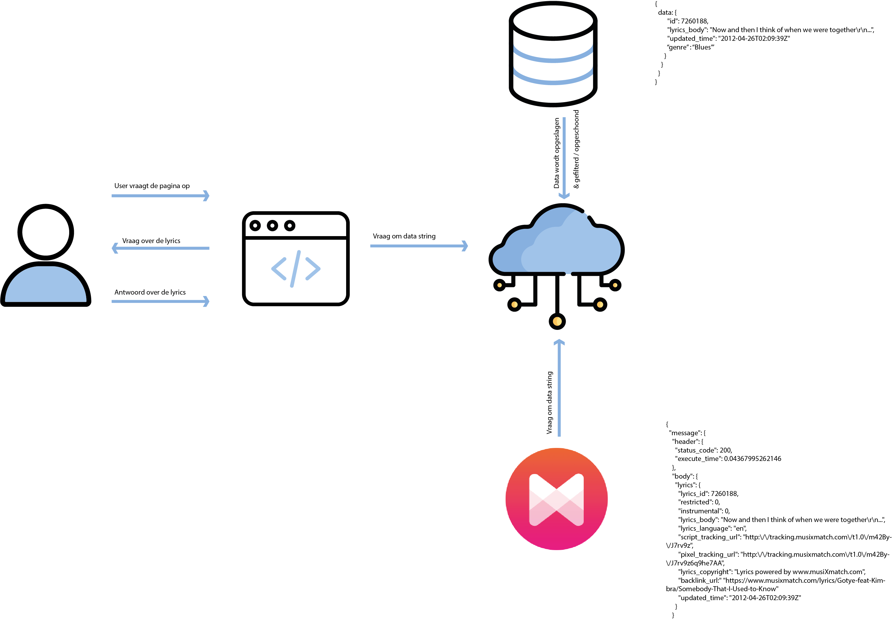

# project

practice socket.io.

## Concept

I used the API from musixmatch.com to get lyrics and track details. My plan as of right now, is to present the user with a piece of lyric of an unknown random track. The idea is to guess the next word or guess the genre. Whatever is more compatible with the data I have.

The real time aspect is to do this with multiple users in a room, to make it a battle.

## Set up
**1. Clone repository:**
```
git clone https://github.com/leoniesmits/real-time-web-1920.git
```
**2. Get all dependencies:**
```json
{
"dependencies": {
    "body-parser": "^1.19.0",
    "dotenv": "^8.2.0",
    "ejs": "^3.0.1",
    "express": "^4.15.2",
    "request": "^2.88.2",
    "socket.io": "^2.3.0"
  }
} 
```
Run:
```
npm install
```

**3. Build and start server:**
```
nodemon
```

**4. Open the app**

Navigate to [localhost:1400](localhost:1400) in your browser to see the app.

## Diagram 



## License
MIT © Leonie Smits
