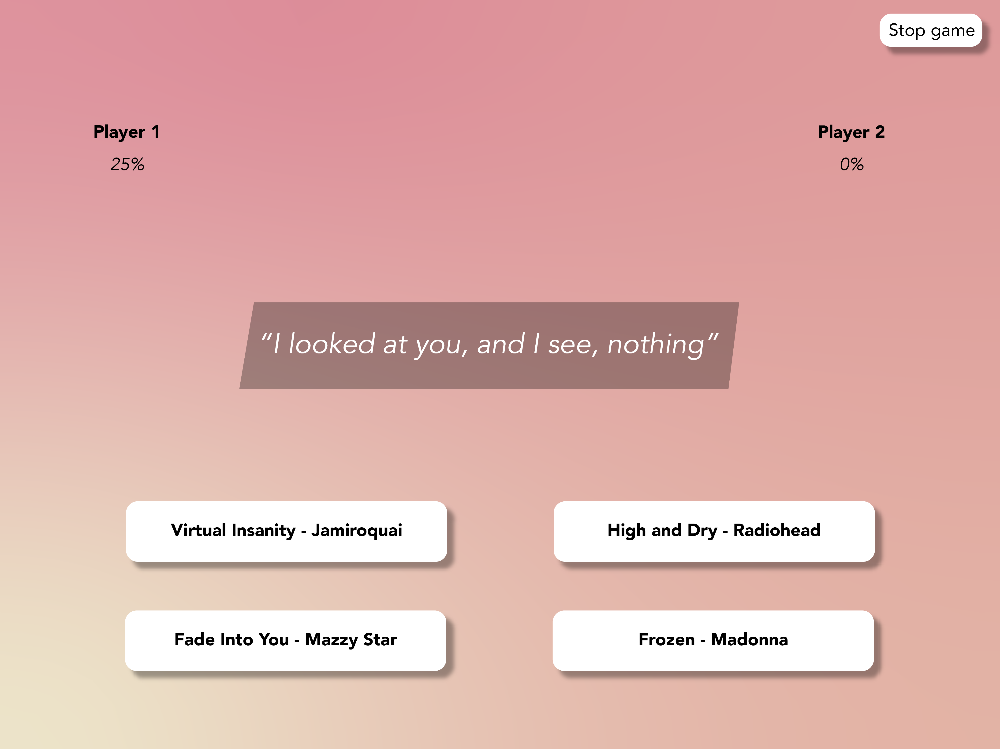

# Lyric guessing game

<p align="center"><b>Battle your friend in lyric-knowledge. Choose a decade, load songs and guess lyrics.</p></b>


_This is what the screen should have looked like._

## Introduction
This project was an assignment of [@cmda-minor-web](https://github.com/cmda-minor-web/real-time-web-1920). The goal of this course was to create a real time app based on [sockets](https://socket.io/). 

I used the API from musixmatch.com to get lyrics and track details. My plan is to present the user with a piece of lyric of an unknown random track. There are 4 track titles loaded, the user has to guess to which the lyrics belong.

The real time aspect is to do this with multiple users in a room, to make it a battle.

## Table of Contents

- [Setup and Installation](#setup-and-installation)
- [Diagram](#diagram)
- [My app](#my-app)
  - [Features](#features)
  - [Getting data](#getting-data)
  - [Game](#game)
  - [Score](#score)
- [To do](#to-do)
- [Credits](#credits)
- [License](#license)


## Setup and Installation
**1. Clone repository:**
```
git clone https://github.com/leoniesmits/real-time-web-1920.git
```
**2. Get all dependencies:**
```json
{
"dependencies": {
    "axios": "^0.19.2",
    "body-parser": "^1.19.0",
    "cookie-parser": "^1.4.5",
    "dotenv": "^8.2.0",
    "ejs": "^3.0.1",
    "express": "^4.15.2",
    "express-session": "^1.17.1",
    "http-errors": "^1.7.3",
    "request": "^2.88.2",
    "socket.io": "^2.3.0"
  }
} 
```
Run:
```
npm install
```

**3. Build and start server:**
```
nodemon
```

**4. Open the app**

Navigate to [localhost:1400](localhost:1400) in your browser to see the app.

## Diagram


### Features 
- Players pick a decade to fetch lyrics
- 2 players can be in one room
- 3rd players watch, until game is over
- Time progress bar runs out, each level is 10 seconds

### Getting data

Originally I was going to get song data from Spotify, but OAuth was giving me a hard time. After some sad attempts to get some data, [Kris](https://github.com/kriskuiper) helped me and now I have some data from spotify locally stored. 

This local data, found under `data/playlists` are some JSON files containing detailed metadata. This data is later connected to my API fetch 

```
const getTrackLyrics = function (obj) {
    const title = obj.song;
    const artist = obj.artists[0];
    const url = 'https://api.musixmatch.com/ws/1.1/matcher.lyrics.get?' +
        querystring.stringify({
            format: 'json',
            apikey: api_key
        });
    return axios.get(url).then(res => {
        if (res.status === 200 && 
            res.data.message.body && 
            res.data.message.body.lyrics) {
                return res.data.message.body.lyrics.lyrics_body;
            }
        else {
            return false;
        }
    }).catch(err => {
        return err;
    });
};
```

This should give me tracks of the Musixmatch API, but doesn't seem to work anymore. 

### Game 

### Scores

## Credits
[Guido](https://github.com/guidobouman) for help with concept.
[Laurens ](https://github.com/Razpudding) for ideas and iteration.
[Kris](https://github.com/kriskuiper) for troubleshooting, explanations.
[Robin](https://github.com/RobinStut) for Node related help.


## License
MIT © Leonie Smits
